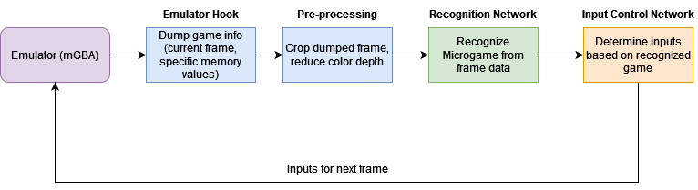
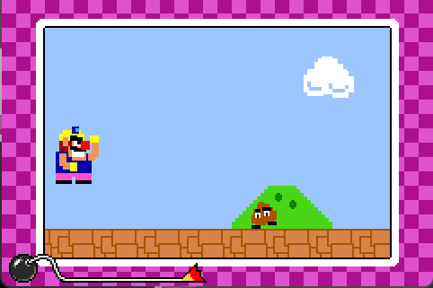
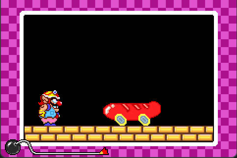
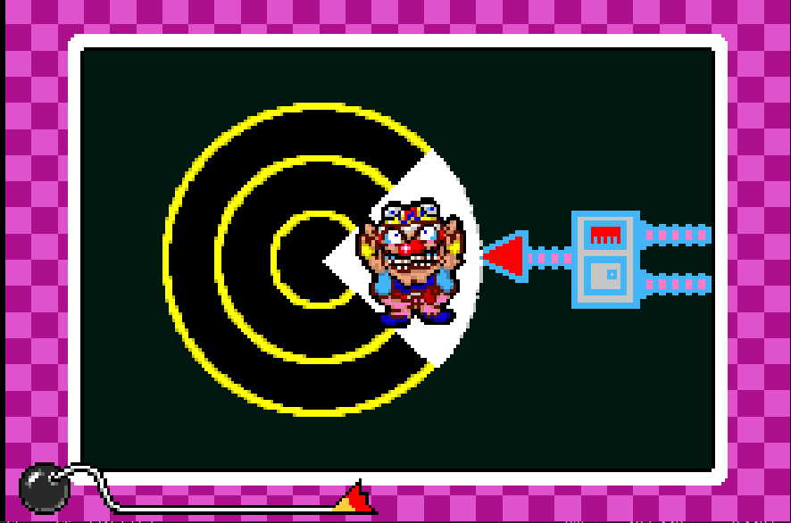
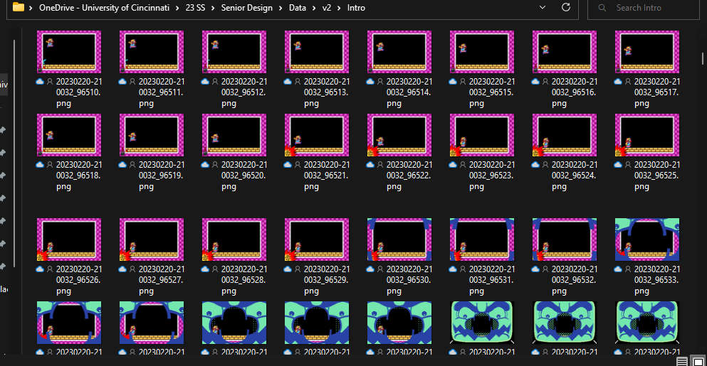

# WarioWare and the Case for Reversing

## Background

The goal of this entire project is to create a system that can regonize tasks based solely on visual input. On a high level, this consists of an emulator-in our case [mGBA](https://mgba.io/)-and a machine learning framework-in our case [Keras](https://keras.io/). Eventually, we would like to chain the output to another network, which can provide inputs to the input.

## Why WarioWare?

[_WarioWare, Inc.: Mega Microgames!_](https://en.wikipedia.org/wiki/WarioWare,_Inc.:_Mega_Microgames!) is a 2003 GameBoy Advance game that primarily consists of players completing short, randomized (micro)games in short succession. Play ends when the player runs out of their 4 lives.

We feel that _WarioWare_ works as an example model for the following reasons:

- Microgames are short and have very simple controls, often requring the use of only one or two buttons.
- Microgames tend to have a distinctive, simple art style that should aid in recognition.
- The GBA has a screen resolution of 240 x 160. Therefore, individual screenshots have a comparatively small size, at around 3-5KB.
- _WarioWare_ is fun to play, so generating data will be less of a chore.

## What's In the Input Data Set?

Our input data consists of the raw frame data from WarioWare. Luckily, rather than rely on an external program to capture the images, we can utilize [mGBA's Lua scripting API](https://mgba.io/docs/scripting.html) to help us out. By utilizing the `frame` callback, we are able to [dump every frame](https://www.youtube.com/watch?v=7vOS5wDY8do).

Each frame dumped is a 240 x 160 PNG image, numbered based on the current frame emulated. In about 10-15 minutes of playtime, we get around 94MB of data.

While this does give us a _lot_ of genrated data very quickly, we run into a few problems. The first being the need to sort all of the data. Ideally, we will want to sort the data into each minigame, as this will give us the most useful categorization for training the model. However, a quick look at the data set quickly proves that this simply is not feasible by hand:

Additionally, _WarioWare_ contains both short transitions between microgames-generally on the order of 2-3 seconds at the start of a run, gradually decreasing the further the player gets, as well as longer intermissions intended to give the player a break-around 10-15 seconds. These moments, as well as time spent in the menus, generate a lot of junk data that also needs to be filtered out.
